# Semantic Segmentation for Autonomous Vehicles using YOLOv8

## Overview

This repository contains the implementation of semantic segmentation for autonomous vehicles using YOLOv8. The project explores the performance of two YOLOv8 variants, YOLOv8s (small) and YOLOv8l (large), across various metrics and tasks. We provide a comprehensive analysis of model performance, focusing on key classes, the impact of learning rates, and detailed comparisons between the two models.

## Models

- **YOLOv8s (Small):** A smaller, faster model suitable for applications requiring lower computational resources.
- **YOLOv8l (Large):** A larger, more complex model that offers better accuracy and performance but requires more computational power.

## Key Features

- Semantic segmentation for autonomous driving tasks.
- Comprehensive performance analysis of YOLOv8s and YOLOv8l models.
- Detailed examination of precision, recall, F1 scores, and mean Average Precision (mAP).
- Evaluation of the impact of learning rates on model performance.

## Performance Analysis

### Comprehensive Comparison: YOLOv8s vs. YOLOv8l

#### Learning Rates:
- **YOLOv8s:** 0.0001
- **YOLOv8l:** 0.00001

### Metrics and Performance Curves

#### F1-Confidence Curves:

1. **YOLOv8s:**
   - Overall F1 score: 0.82 at confidence 0.525.
   - MaskF1 score: 0.81 at confidence 0.525.

2. **YOLOv8l:**
   - Overall F1 score: 0.83 at confidence 0.629.
   - MaskF1 score: 0.83 at confidence 0.629.

**Observation:** YOLOv8l shows a slight improvement in the overall F1 score and confidence compared to YOLOv8s.

#### Precision-Confidence Curves:

1. **YOLOv8s:**
   - Overall precision: 1.00 at confidence 0.919.
   - Mask precision: 0.99 at confidence 0.897.

2. **YOLOv8l:**
   - Overall precision: 1.00 at confidence 0.970.
   - Mask precision: 0.99 at confidence 0.970.

**Observation:** Both models have high precision, with YOLOv8l achieving this at a slightly higher confidence level.

#### Precision-Recall Curves:

1. **YOLOv8s:**
   - mAP at 0.5 IoU: 0.849.
   - Mask mAP at 0.5 IoU: 0.865.

2. **YOLOv8l:**
   - mAP at 0.5 IoU: 0.873.
   - Mask mAP at 0.5 IoU: 0.854.

**Observation:** YOLOv8l demonstrates a higher mAP, indicating better precision-recall balance.

#### Recall-Confidence Curves:

1. **YOLOv8s:**
   - Overall recall: 0.94 at confidence 0.000.
   - Mask recall: 0.96 at confidence 0.000.

2. **YOLOv8l:**
   - Overall recall: 0.96 at confidence 0.000.
   - Mask recall: 0.92 at confidence 0.000.

**Observation:** YOLOv8l maintains high recall, similar to YOLOv8s.

### Confusion Matrices

#### Confusion Matrix (Raw Counts):

1. **YOLOv8s:**
   - Shows the true positive, false positive, and false negative counts for each class.

2. **YOLOv8l:**
   - Similar layout showing class-specific performance.

**Observation:** Both models' confusion matrices reveal the class-specific performance and misclassifications. A detailed comparison shows improvements in certain classes for YOLOv8l.

#### Confusion Matrix (Normalized):

1. **YOLOv8s:**
   - Normalized values show the proportion of correct predictions.

2. **YOLOv8l:**
   - Similar normalized matrix indicating slight improvements in classification accuracy.

**Observation:** Normalized matrices highlight relative performance, with YOLOv8l showing minor improvements in specific classes.

### Label Distribution and Bounding Box Analysis

1. **Labels Distribution and Correlogram (YOLOv8s & YOLOv8l):**
   - Both models show the distribution of instances per class and bounding box spatial distributions.

**Observation:** The distribution and spatial patterns are similar, with slight differences potentially impacting class-specific performance.

### Learning Curves

1. **YOLOv8s Learning Curves:**
   - Training and validation losses decrease steadily, indicating effective learning.
   - Precision and recall metrics improve over epochs.

2. **YOLOv8l Learning Curves:**
   - Similar trend of decreasing training and validation losses.
   - Precision and recall metrics show consistent improvement, with YOLOv8l reaching higher mAP values.

**Observation:** YOLOv8l demonstrates more stable and slightly better learning curves, reflecting in improved overall performance metrics.

### Detailed Class-Specific Performance:

#### Class-Specific Analysis (Confusion Matrix):

1. **Bicyclist:**
   - YOLOv8s: Some misclassifications observed.
   - YOLOv8l: Slight improvement in correct predictions.

2. **Building:**
   - YOLOv8s: High accuracy with minor misclassifications.
   - YOLOv8l: Improved accuracy and fewer misclassifications.

3. **Car:**
   - YOLOv8s: High precision and recall.
   - YOLOv8l: Maintains high performance with minor improvements.

4. **Person:**
   - YOLOv8s: Moderate performance with some errors.
   - YOLOv8l: Slight improvement in precision and recall.

**Overall Class-Specific Observation:** YOLOv8l shows minor improvements across various classes, reducing misclassifications and improving precision and recall.

## Conclusion:

1. **Performance Improvements:**
   - YOLOv8l with a learning rate of 0.00001 shows slight improvements in F1 score, mAP, and recall compared to YOLOv8s with a learning rate of 0.0001.
   - Precision remains high for both models, with YOLOv8l achieving high precision at slightly higher confidence levels.

2. **Model Stability:**
   - YOLOv8l demonstrates more stable learning curves, indicating consistent improvement over epochs.

3. **Class-Specific Performance:**
   - Confusion matrices reveal slight improvements in class-specific accuracy and fewer misclassifications for YOLOv8l.

**Recommendations:**
- Further tuning of hyperparameters and additional training data may enhance performance.
- Targeted analysis of class-specific errors can guide improvements in the model.

This comprehensive comparison highlights the strengths of YOLOv8l in achieving slightly better performance across various metrics, making it a better choice for specific use cases requiring higher precision and recall.

## Installation

1. Clone the repository:
   ```sh
   git clone https://github.com/sandeeppandey1108/semantic-segmentation-for-autonomous-vehicles-using-YOLOv8.git
   cd semantic-segmentation-for-autonomous-vehicles-using-YOLOv8
   ```

2. Install the required packages:
   ```sh
   pip install

 -r requirements.txt
   ```

## Usage

1. **Training:**
   ```sh
   python train.py --model yolov8s --data your_dataset.yaml --epochs 100 --lr 0.0001
   ```

2. **Evaluation:**
   ```sh
   python evaluate.py --model yolov8l --data your_dataset.yaml
   ```

3. **Inference:**
   ```sh
   python inference.py --model yolov8s --source path_to_images/
   ```

## Results
 # YOLOv8s Results
<div>
  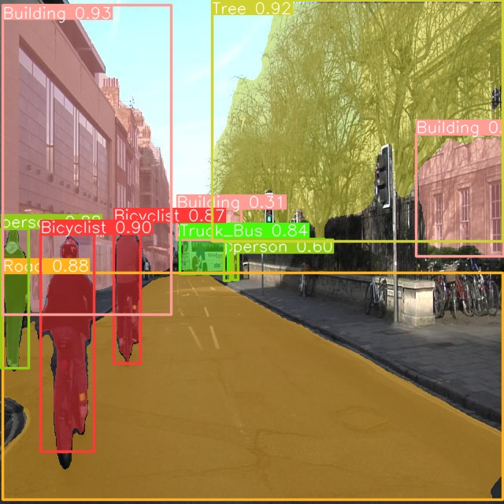
  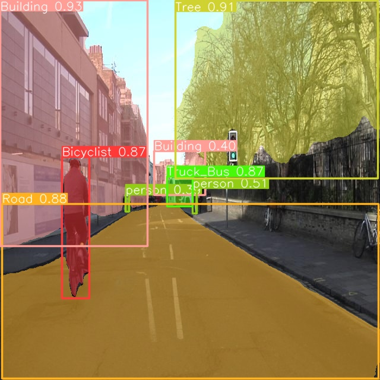
  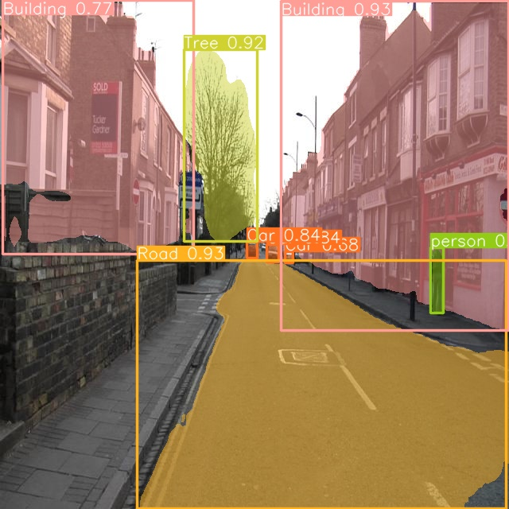
  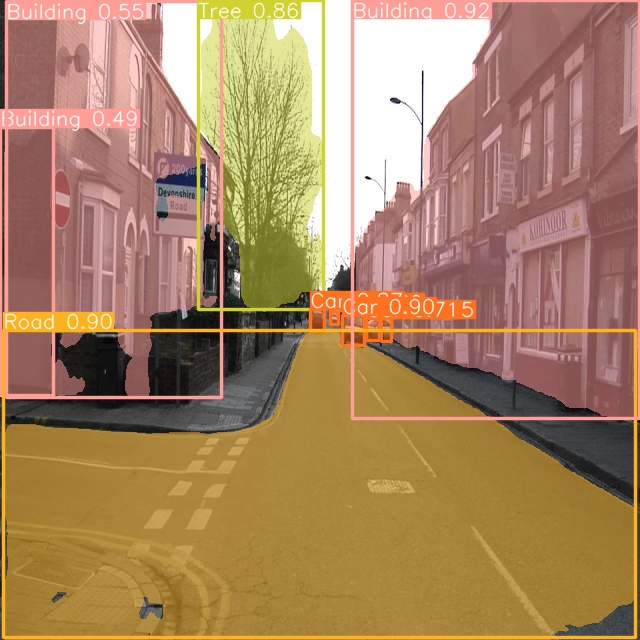
  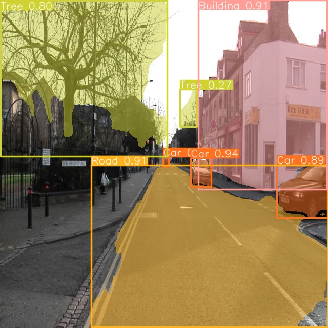
  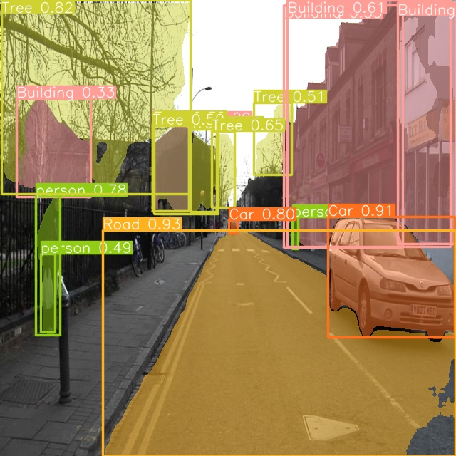
  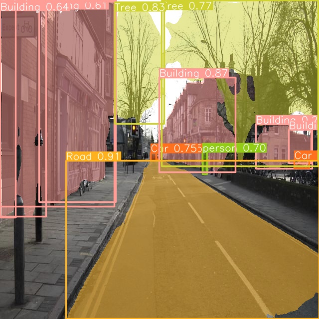
  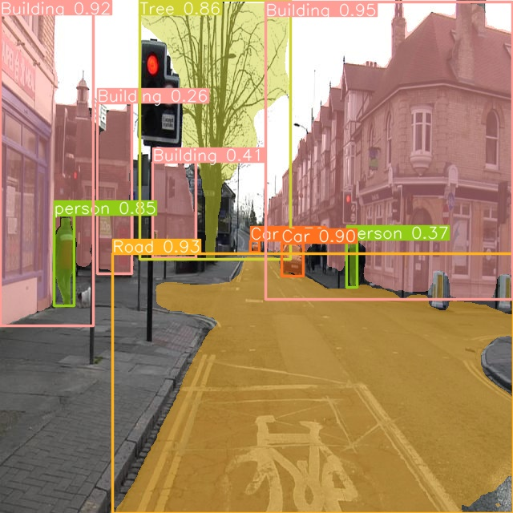
  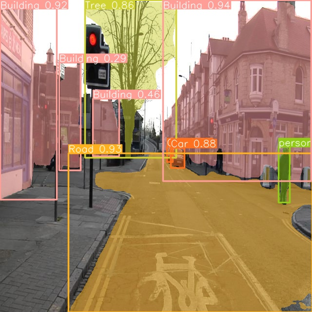
  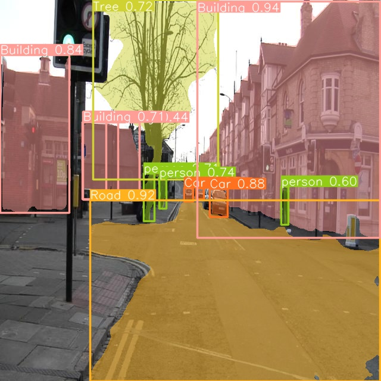
  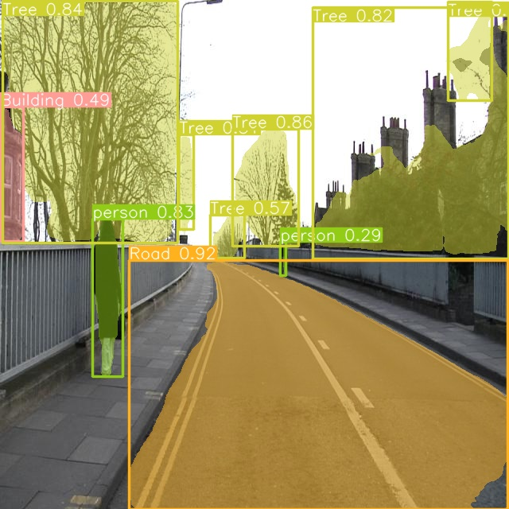
  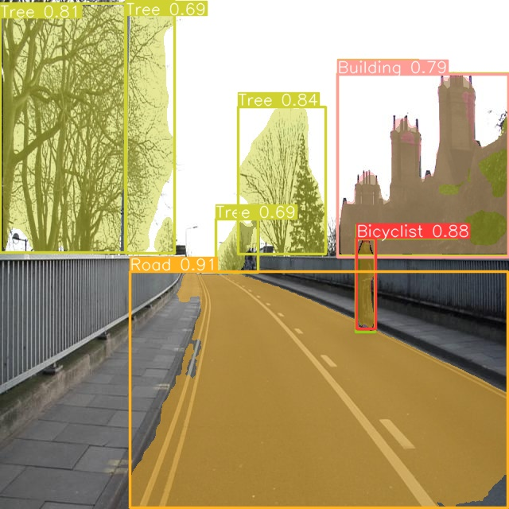
  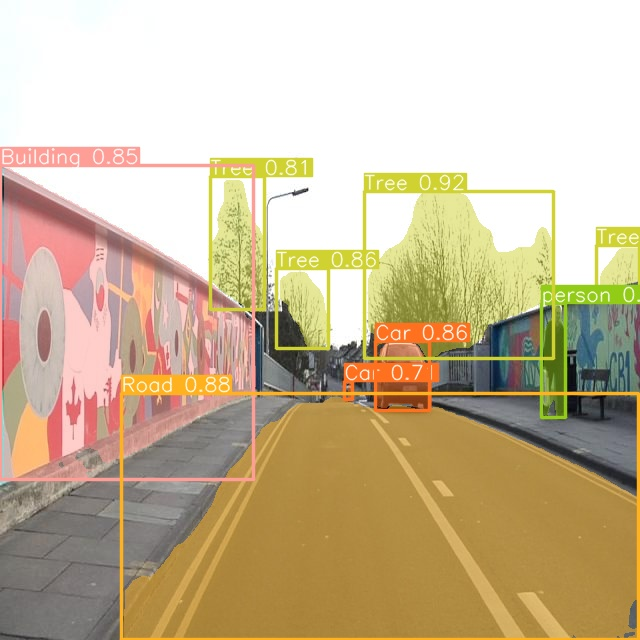
  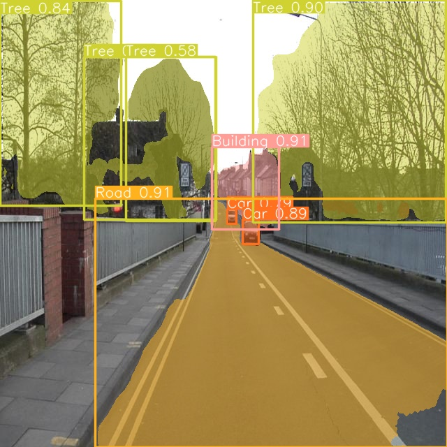
  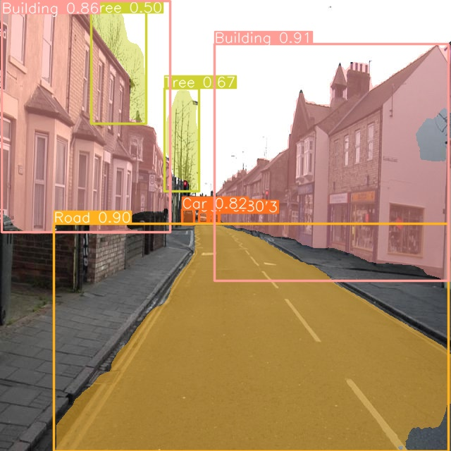
  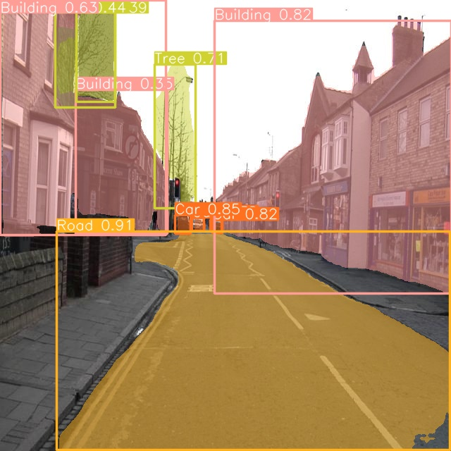
  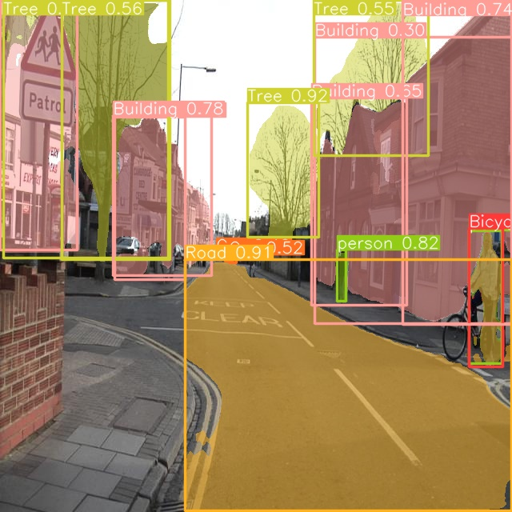
</div>
YOLOv8l Results
<div>
  
  
  
  
  
  
  
  
  
  
  
  
  
  
  
  
  
</div>

## Acknowledgments

- YOLOv8 framework
- Autonomous driving research community

For any questions or issues, please contact [sandeeppandey00880@gmail.com].
```

